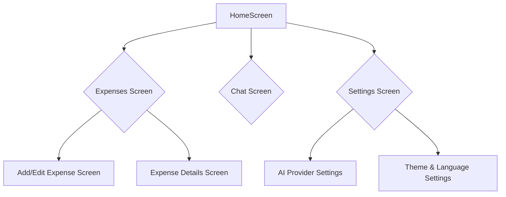

# Navigation Architecture

## 1. Overview

This document outlines the navigation structure of the **Our Spends** application. The navigation is designed to be simple, intuitive, and consistent, ensuring that users can easily access all features without confusion.

The primary navigation is handled by a bottom navigation bar, which provides access to the three core sections of the app: **Expenses**, **Chat**, and **Settings**.

## 2. Guiding Principles

- **Simplicity**: The navigation is kept minimal to avoid overwhelming the user.
- **Accessibility**: Core features are accessible with a single tap from the main screens.
- **Consistency**: The navigation patterns are consistent with platform conventions (iOS and Android).
- **Scalability**: The structure is designed to accommodate future features without major refactoring.

## 3. Main Navigation

The app's `HomeScreen` widget manages the main navigation, utilizing a `PageView` to switch between the three primary screens and a `NavigationBar` for the bottom tabs.

### 3.1. Bottom Navigation Bar

- **Expenses Screen**: The default landing screen. It displays a summary of recent expenses, categorized lists, and a floating action button to add new entries.
- **Chat Screen**: Provides a conversational interface for adding expenses, querying data, and receiving AI-powered insights.
- **Settings Screen**: Contains all application-level settings, including language, theme, AI provider configuration, and data management.

## 4. Screen Flow and Hierarchy

The following diagram illustrates the primary navigation flow:

- **HomeScreen**: The root widget that contains the bottom navigation bar and hosts the main screens.
- **Expenses Screen**: From here, users can navigate to add a new expense or view the details of an existing one.
- **Settings Screen**: Provides access to various configuration screens.

## 5. Key Navigation Components

- **`HomeScreen.dart`**: The stateful widget that orchestrates the primary navigation.
- **`NavigationBar`**: The bottom navigation bar component.
- **`FloatingActionButton`**: Conditionally displayed on the Expenses screen for quick access to add a new expense.
- **`Navigator`**: Used for pushing and popping individual screens onto the navigation stack (e.g., opening the `Add/Edit Expense` screen).

## 6. Future Enhancements

- **Deep Linking**: Allow users to open specific screens within the app from external links.
- **Tabbed Views**: Introduce tabs within the Expenses screen for different views (e.g., by month, by category).
- **Enhanced Search**: Integrate a more powerful search experience directly within the Chat screen.